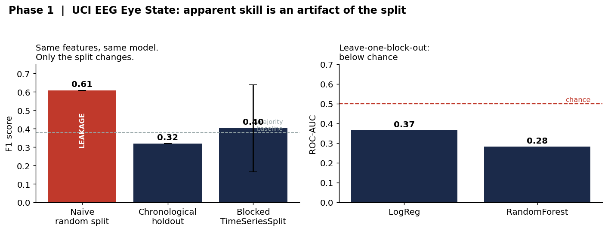
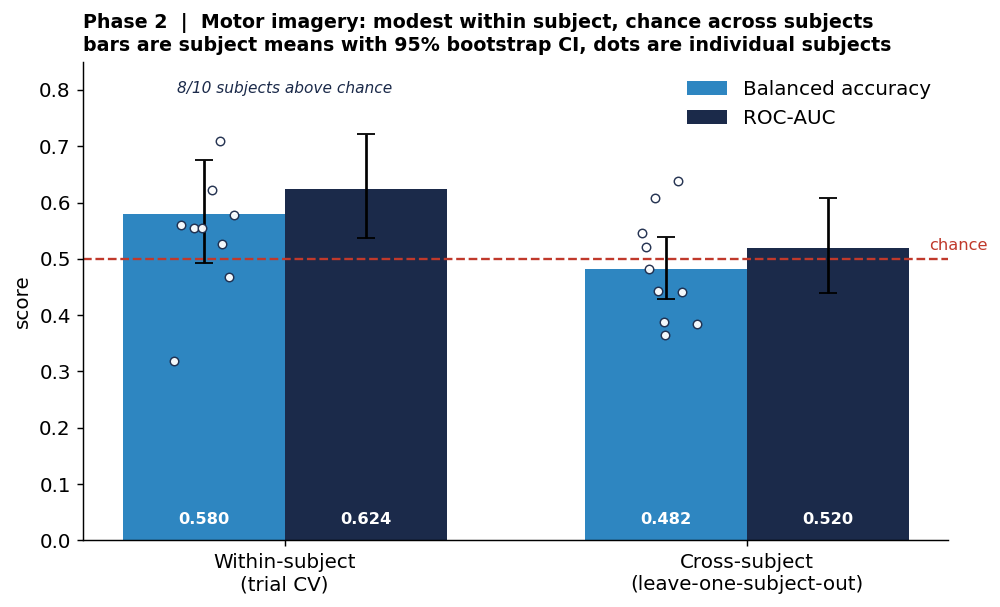
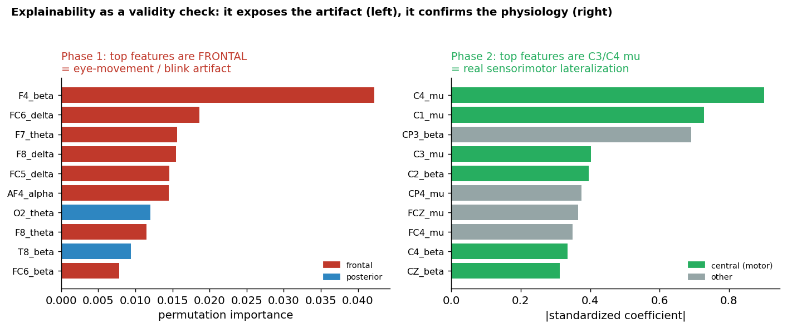

# NeuroSense: Leakage-Aware, Explainable EEG Decoding

**An honest look at when EEG machine learning actually generalizes, and when it only appears to.**

Most introductory EEG classification projects report a high accuracy and stop there. This project asks whether that accuracy is real. Across two datasets and two paradigms, it shows that the headline numbers commonly reported on a popular EEG benchmark are an artifact of how the data is split, quantifies the honest performance under leakage-aware evaluation, and uses model explanations as a validity check rather than decoration.

A full write-up is in [`reports/NeuroSense_Report.pdf`](reports/NeuroSense_Report.pdf).

## Core finding

> Naive evaluation overstates EEG decoding. Under leakage-aware evaluation, EEG band-power features mostly capture session-specific and subject-specific structure that does not generalize across time or across people. Where decoding genuinely works, its explanations match known physiology. Where it only appears to work, the explanation exposes the artifact.

## Results at a glance

| Setting | Evaluation | Result | Reading |
|---|---|---|---|
| Phase 1 (eye state) | Naive random split | F1 = 0.61 | inflated, leaked |
| Phase 1 (eye state) | Chronological holdout | F1 = 0.32 | below majority baseline |
| Phase 1 (eye state) | Blocked TimeSeriesSplit | F1 = 0.40 ± 0.24 | at chance, unstable |
| Phase 1 (eye state) | Leave-one-block-out | AUC = 0.28 to 0.37 | below chance |
| Phase 2 (motor imagery) | Within-subject (trial CV) | balAcc = 0.58, AUC = 0.61, 8/10 above chance | honest, modest, real |
| Phase 2 (motor imagery) | Cross-subject (leave-one-subject-out) | balAcc = 0.49, AUC = 0.48 | chance |

All numbers are produced by the code in this repo. Nothing is rounded up.

---

## Phase 1: UCI EEG Eye State (the cautionary result)

**Dataset.** A single continuous 117-second recording from one person, 14 channels at 128 Hz. The eyes-open/closed label runs in only 24 contiguous blocks (median ~3.9 s). Several channels contain single-sample electrode pops up to ~700,000 against a ~4,000 baseline, clipped before feature extraction. One-second non-overlapping windows yield 100 windows and 56 band-power features (delta, theta, alpha, beta; gamma is excluded because 30 to 45 Hz on consumer hardware is dominated by muscle activity, not cortex).

**The leakage trap.** Because the label runs in long blocks, neighboring samples are near-identical and share a label. A random shuffled split scatters those neighbors across train and test, so the model scores well by recognizing near-duplicates it has already seen. Holding the split constant in every other respect and changing only how it is drawn produces the entire performance gap:



Three independent leakage-aware protocols agree: performance sits at or below chance. AUC *below* 0.5 under leave-one-block-out means the band-power features encode which time-segment a window came from (electrode drift, non-stationarity) rather than the eye state, so a model trained on the early session mislabels the late session.

**Explainability as a validity check.** A pre-modeling check found no clean Berger effect in this recording (occipital alpha does not rise on eye closure). The most class-separating features are frontal, consistent with eye-movement and blink artifact picked up by frontal electrodes rather than posterior alpha. The explanation exposed the artifact (see the left panel of the interpretability figure below).

**Takeaway.** The widely reported >90% accuracies on this dataset are an artifact of evaluation design. A single continuous recording cannot support generalizable eye-state decoding. This motivates moving to data built for generalization.

---

## Phase 2: PhysioNet Motor Imagery (the honest result)

**Dataset.** PhysioNet EEG Motor Movement/Imagery, imagined left vs right fist. 10 subjects, 64 channels at 160 Hz, 437 trials. Features are mu (8 to 13 Hz) and beta (13 to 30 Hz) band power over a 13-channel sensorimotor strip (26 features), the same band-power approach as Phase 1 applied to data with many independent trials and multiple subjects.

**Two honest evaluations.** Within a subject (trial-level cross-validation), decoding is honestly above chance but modest, with 8 of 10 subjects above chance and clear between-subject variability. Across subjects (leave-one-subject-out), performance collapses to chance: the features are subject-specific and do not transfer to a new person without calibration.



**Explainability as a validity check, again.** The within-subject model keys on the C3 versus C4 mu rhythm, the lateralized sensorimotor pattern expected from contralateral desynchronization during motor imagery. Here the explanation *confirms* known physiology. The contrast with Phase 1 is the centerpiece of the project:



Same interpretability method, opposite verdicts: on the left it catches a result that is not real, on the right it corroborates one that is.

---

## Unified finding

Across both datasets, naive evaluation overstates performance. Leakage-aware evaluation reveals that EEG band-power features capture session drift (Phase 1) and subject identity (Phase 2), neither of which is the intended target. Honest within-subject motor-imagery decoding is achievable but modest, and its explanations align with sensorimotor physiology. Model explanations are trustworthy as evidence only when the evaluation underneath them is leakage-free.

## Repository structure

```
src/
  features.py             # Phase 1: artifact clipping, windowing, band-power features
  train.py                # Phase 1: chronological / TimeSeriesSplit / leakage demo / importance
  physionet.py            # Phase 2: EDF loading, epoching, sensorimotor band-power features
  evaluate_physionet.py   # Phase 2: within-subject and cross-subject evaluation
  make_figures.py         # regenerates the three figures from data
reports/
  NeuroSense_Report.pdf   # 5-page write-up (start here)
  NeuroSense_Report.tex   # its LaTeX source
  results.json            # Phase 1 numbers
  physionet_results.json  # Phase 2 numbers
  figures/                # the three figures above
scripts/
  download_data.sh        # fetches both datasets (data is not stored in the repo)
data/processed/           # cached PhysioNet feature matrix (small)
```

## Reproduce

```bash
pip install -r requirements.txt
bash scripts/download_data.sh      # downloads UCI + PhysioNet (not committed to the repo)
python src/train.py                # Phase 1
python src/evaluate_physionet.py   # Phase 2
python src/make_figures.py         # figures
```

## Limitations

Phase 1 is a single subject and single session on consumer-grade hardware, so its results are not subject-generalizable and its high-frequency content is unreliable. Phase 2 uses 10 of the 109 available subjects, so the within-subject confidence interval is wider than it needs to be. Windowing produces a small effective sample in Phase 1 (100 windows), which is why variance across folds is reported rather than a single number.

## Future work

Scale Phase 2 to all 109 subjects to tighten the within-subject estimate; add common spatial pattern (CSP) features, which are the standard for motor imagery; attempt subject-adaptive transfer to move cross-subject decoding above chance; and explore deep models only after establishing these leakage-safe baselines.

## Data and licensing

Datasets are downloaded by `scripts/download_data.sh` and are not redistributed here. UCI EEG Eye State: UCI Machine Learning Repository (dataset 264). PhysioNet EEG Motor Movement/Imagery Database v1.0.0 (Schalk et al., 2004; Goldberger et al., 2000). Code in this repository is released under the MIT License.
