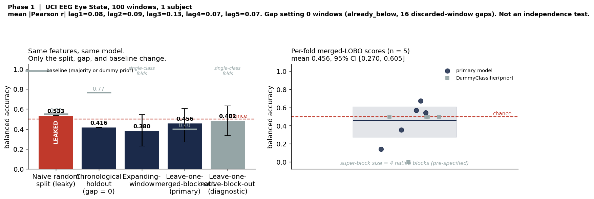
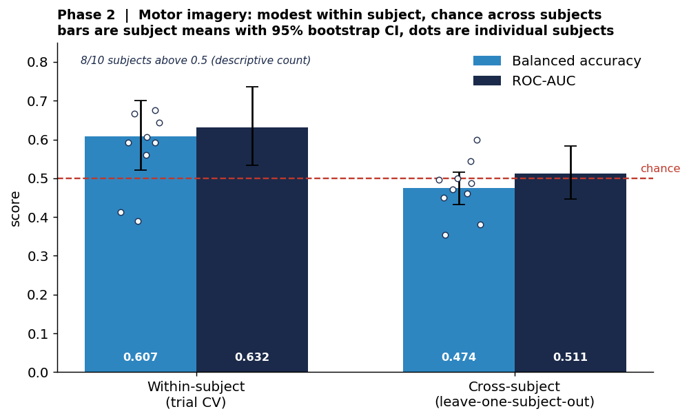
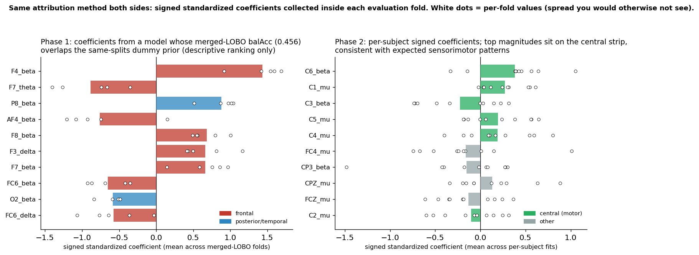

# NeuroSense: Leakage-Aware, Explainable EEG Decoding

This repository reports band-power logistic regression, and a CSP plus LDA baseline, on two public EEG recordings. The splits are a random split, a chronological holdout, walk-forward blocks, leave-one-block-out, leave-one-subject-out, and leave-one-run-out. CSP plus LDA is the motor-imagery baseline of Ramoser, Müller-Gerking, and Pfurtscheller (2000). The numbers below are what this code produced on these files.

A full write-up is in [`reports/NeuroSense_Report.pdf`](reports/NeuroSense_Report.pdf).

## Core finding

> On the UCI eye-state recording, one subject, the merged-block balanced-accuracy interval includes the same-split dummy prior. On the ten-subject PhysioNet subset, band-power logistic regression leave-one-subject-out balanced accuracy is 0.470 [0.423, 0.524]. CSP plus LDA leave-one-subject-out balanced accuracy on the same ten subjects is 0.569 [0.519, 0.627]. Coefficient lists are the fitted weights of the band-power logistic regression. They are not a physiological result.

## How to read the numbers

Both phases fit preprocessing inside each fold and use one prespecified model: logistic regression, C = 1.0, `class_weight="balanced"`, `max_iter=5000`, `random_state=42`. Other models appear only in secondary tables. The bands are not the same. Phase 1 uses delta (1 to 4 Hz), theta (4 to 8 Hz), alpha (8 to 13 Hz), and beta (13 to 30 Hz). Phase 2 uses mu (8 to 13 Hz) and beta (13 to 30 Hz).

**The unit of inference is the subject, or in Phase 1 the label block, never the epoch.** Every interval below comes from `src.core.statistics.bootstrap_ci`: 10,000 resamples of those group scores with `numpy.random.Generator` seed 42, and the 2.5 and 97.5 percentiles of the resampled means (`numpy.percentile`, linear interpolation). Trials are not resampled. A different bootstrap can move a lower endpoint that sits near 0.5 across 0.5. Pooled epoch-level figures stay in the JSON as descriptive only.

**Every leakage-safe split reports its own baselines.** A most-frequent dummy, a stratified dummy, and a uniform dummy are fitted on training labels and scored with balanced accuracy, macro F1, and ROC-AUC. Nothing is shared across protocols. On a single-class test fold, the most-frequent dummy's balanced accuracy is 0 or 1.

All numbers are produced by the code in this repo and stored in `reports/results/`. Nothing is rounded up.

## Results at a glance

| Setting                 | Evaluation                                                   | Result                                                                                          | Reading                              |
| ----------------------- | ------------------------------------------------------------ | ----------------------------------------------------------------------------------------------- | ------------------------------------ |
| Phase 1 (eye state)     | Naive random window split                                    | balAcc = 0.533; most-frequent dummy balAcc 0.500; stratified dummy balAcc 0.581                 | leaky                                |
| Phase 1 (eye state)     | Chronological holdout (gap = 0 windows, training prefix)     | balAcc = 0.416, macro F1 = 0.330, AUC = 0.491; most-frequent dummy balAcc 0.500, macro F1 0.189 | below the dummy on balanced accuracy |
| Phase 1 (eye state)     | Expanding-window (13 folds across blocks, gap prespecified 0)| balAcc = 0.380 [0.230, 0.545]                                                                   | wide interval                        |
| Phase 1 (eye state)     | Leave-one-merged-block-out (4 folds; remainder attached)     | balAcc = 0.517 [0.401, 0.631], AUC = 0.518 [0.396, 0.617]; dummy-prior balAcc 0.500             | balanced accuracy overlaps the dummy |
| Phase 1 (eye state)     | Leave-one-native-block-out (19 single-class folds)           | diagnostic only; pooled AUC 0.437 real vs 0.000 dummy prior on same splits, i.e. split artefact | do not read as drift                 |
| Phase 1 (eye state)     | Cross-subject                                                | not available                                                                                   | one subject                          |
| Phase 2 (motor imagery) | Naive random trial split                                     | balAcc = 0.516, AUC = 0.551                                                                     | leaky contrast                       |
| Phase 2 (motor imagery) | Within-subject shuffled trial CV                             | balAcc = 0.607 [0.546, 0.688], AUC = 0.644 [0.577, 0.729]; 9/10 and 10/10 subjects above 0.5    | modest                               |
| Phase 2 (motor imagery) | Within-subject leave-one-run-out (10 subject means)          | balAcc = 0.574 [0.498, 0.654], AUC = 0.633 [0.545, 0.729]; same-session runs only               | interval includes 0.5                |
| Phase 2 (motor imagery) | Cross-subject, band-power logistic regression                | balAcc = 0.470 [0.423, 0.524], AUC = 0.518 [0.450, 0.593]                                       | ten-subject subset; interval includes 0.5 |
| Phase 2 (motor imagery) | Cross-subject, CSP plus LDA                                  | balAcc = 0.569 [0.519, 0.627]                                                                   | same ten subjects                     |

The 2026-09 audit added (a) temporal-gap chronological holdout and expanding-window on Phase 1, (b) leave-one-merged-block-out with a DummyClassifier(prior) diagnostic that replaces single-class native LOBO as the primary group protocol, (c) leave-one-run-out within subject on Phase 2, (d) persisted per-fold labels, predictions, and probabilities in Phase 2 JSON, (e) per-split baselines throughout, (f) a hardened raw-data reproduction path with a manifest of SHA-256 source-file checksums, (g) signed per-fold coefficients captured and consumed by the figure code so figures do not refit models, and (h) a CSP + LDA extension for Phase 2 as a separately labelled comparison to the audited band-power primary. The primary model is the same as before (LogisticRegression, C = 1.0, balanced). See [`REFACTOR_NOTES.md`](REFACTOR_NOTES.md) and [`reports/AUDIT_LOG.md`](reports/AUDIT_LOG.md) for the full change list.

**How to read the four rounds.** Round 1 fixed preprocessing leakage and Phase 1 baselines. Round 2 corrected the leave-one-block-out analysis and rebuilt Phase 2 reporting. Round 3 corrected interpretation language, unified the attribution method across both figures, and hardened raw-data reproduction. Round 4 removed duplicated evaluation logic (figures and tables now read the same JSON, no refit), added the CSP+LDA extension, added the CI workflow, and expanded test coverage. Numbers reported here are from the rerun after the header-length check, the subject-level leave-one-run-out bootstrap, the training-fitted dummies, the remainder rule, and the training-only gap. Historical pre-audit numbers stay under `reports/results/archive/pre-audit-<commit>/` and `reports/figures/archive/pre-audit-<commit>/`.

"Above 0.5" is a descriptive count, not a significance claim. The bootstrap resamples subjects or blocks, never trials. Leave-one-run-out resamples one score per subject, the mean of that subject's run folds. The 30 run rows are stored and are not the interval. These Phase 2 intervals are from the 450-trial cache built after the header check. They are not a re-description of the earlier 30-run intervals.

---

## Phase 1: UCI EEG Eye State (the cautionary result)

**Dataset.** A single continuous 117-second recording from **one person**, 14 channels at 128 Hz. The eyes-open/closed label runs in only 24 contiguous blocks (median 3.9 s), 19 of which contain at least one complete window. Several channels contain single-sample electrode pops up to around 700,000 against a 4,000 baseline, clipped before feature extraction using thresholds fitted on training data only. One-second non-overlapping windows yield **100 windows** and 56 band-power features (delta, theta, alpha, beta). Gamma is not included.

Every Phase 1 number rests on 100 observations from one person. That single fact drives the width of every interval below and is the main reason this phase is a cautionary tale rather than a result.

**Temporal-gap diagnostic.** The chronological gap is the first lag, in kept windows, at which the mean absolute Pearson correlation of the band-power features falls below 0.30. That correlation is computed on the first 70 kept windows only. The clipper is fitted on that prefix and is not applied to later windows. Each side of a pair is centered on the paired rows only. Lag k pairs windows whose start samples differ by exactly k seconds. Mixed-label windows are discarded before this matrix is built: 11 of the 69 index-adjacent training windows are two seconds apart, not one, and those pairs are not lag 1. On the training prefix the lag-1 through lag-5 values are 0.092 (58 pairs), 0.079 (60), 0.150 (57), 0.082 (58), and 0.082 (57). All are below 0.30, so the chronological gap is 0 windows. A value in that range is not evidence that neighbouring windows are independent. The expanding-window gap is prespecified as 0 block groups. It is not copied from this diagnostic. The report is in `temporal_dependence` in the Phase 1 JSON.

**Five leakage-aware protocols, per-split baselines.**

| Protocol                                          | Balanced accuracy    | Macro F1             | ROC AUC              | Most-frequent balAcc | Stratified balAcc | Uniform balAcc |
| ------------------------------------------------- | -------------------- | -------------------- | -------------------- | -------------------- | ----------------- | -------------- |
| Naive random window split (leaky)                 | 0.533                | 0.533                | 0.566                | 0.500                | 0.581             | 0.444          |
| Chronological 70/30 (gap = 0)                     | 0.416                | 0.330                | 0.491                | 0.500                | 0.366             | 0.339          |
| Expanding-window (13 folds)                       | 0.380 [0.230, 0.545] | 0.283 [0.165, 0.432] | undefined            | 0 or 1 per fold      | see note          | see note       |
| **Leave-one-merged-block-out (primary, 4 folds)** | 0.517 [0.401, 0.631] | 0.512 [0.392, 0.624] | 0.518 [0.396, 0.617] | 0.500                | see JSON          | see JSON       |
| Leave-one-native-block-out (diagnostic, 19 folds) | 0.482 [0.334, 0.630] | 0.369 [0.239, 0.515] | undefined            | 0 or 1 per fold      | see note          | see note       |

The dummy columns are balanced accuracy. Each dummy is fitted on training labels and scored with balanced accuracy, macro F1, and ROC-AUC. Macro F1 and AUC for the dummies are in the JSON. On the chronological test segment the most-frequent dummy's macro F1 is 0.189 and its AUC is 0.500. Native leave-one-block-out and expanding-window test folds are single-class, so AUC is undefined. A most-frequent dummy on those folds scores balanced accuracy 0 or 1, depending on whether the training majority matches the held-out class. Super-blocks use 4 native blocks. If the block count is not a multiple of 4, the leftover blocks join the last complete super-block. With 19 native blocks the groups hold 4, 4, 4, and 7 blocks (9, 11, 22, and 58 windows). All 4 super-blocks contain both classes. That count was measured after the groups were assigned.

**On the merged-LOBO number vs a dummy prior.** On the same merged splits, `DummyClassifier(strategy="prior")` scores balAcc = 0.500 [0.500, 0.500], macro F1 = 0.351 [0.310, 0.394], and AUC = 0.500 [0.500, 0.500]. The primary model is balAcc = 0.517 [0.401, 0.631], macro F1 = 0.512 [0.392, 0.624], and AUC = 0.518 [0.396, 0.617]. The balanced-accuracy and AUC intervals include 0.500. The macro F1 intervals do not.

**Reading the native-LOBO diagnostic.** Every native block is single-class, so per-fold AUC is undefined and only the pooled AUC across separately-trained models is a number. On this recording the pooled AUC of the real model is 0.437 and the pooled AUC of `DummyClassifier(strategy="prior")` on the same splits is 0.000. Because the dummy is learning nothing, the sub-chance dummy pooled AUC is a splitting artefact rather than evidence of electrode drift; the same artefact affects any pooled-AUC number on this recording. The native-LOBO row is retained only as a diagnostic for that reason.

The chronological logistic regression scores balanced accuracy 0.416, macro F1 0.330, and AUC 0.491. The most-frequent dummy fitted on the training prefix scores 0.500, 0.189, and 0.500 on those same three metrics. The stratified dummy's balanced accuracy on that split is 0.366.

Secondary models under leave-one-merged-block-out: SVM-RBF and RandomForest (300); see `reports/results/phase1_results.json` for per-fold rows.

**Split comparison.** The random-split balanced accuracy is 0.533. The chronological holdout on the same features and the same model is 0.416. The two numbers differ. This comparison does not identify why.



**Why native-LOBO and expanding-window AUCs are undefined.** Every contiguous native label block is single-class by construction, so a held-out block contains only eyes-open or only eyes-closed windows. AUC cannot be computed on a single-class test set, and balanced accuracy degenerates into the recall of whichever class the block contains. Native LOBO is retained only as a labelled diagnostic and paired with a DummyClassifier(prior) run on the same splits to make the pooled-metric artefact obvious. **Leave-one-merged-block-out is the primary group protocol; chronological holdout is the primary temporal protocol.**

**Coefficients.** Signed standardized logistic-regression coefficients are stored for each merged-LOBO training fold. The largest mean coefficient in the saved JSON is `F4_beta` (+1.364). The merged-LOBO balanced accuracy is 0.517 [0.401, 0.631], and the same-splits dummy prior is 0.500 [0.500, 0.500]. The balanced-accuracy interval includes the dummy. An earlier README treated a frontal ranking as evidence of eye-movement artifact. That sentence is removed. No eye-artifact regressor or blink annotation is in this repository, and no Berger-effect contrast is computed here.

**Takeaway.** On this one recording, the merged-block balanced-accuracy and AUC intervals include the dummy prior. The macro F1 intervals do not. The file has one subject.

---

## Phase 2: PhysioNet Motor Imagery (the honest result)

**Dataset.** PhysioNet EEG Motor Movement/Imagery, imagined left versus right fist. 10 subjects, 450 trials across imagery runs R04, R08, and R12, 15 trials in each run. Features are mu (8 to 13 Hz) and beta (13 to 30 Hz) band power on a 13-channel sensorimotor strip at 160 Hz (26 features). Phase 1 uses four bands, including delta and theta. Phase 2 does not. Eleven of the EDF files previously on disk were shorter than the length declared in the header. This cache was rebuilt after those files were replaced.

| Protocol                                    | Balanced accuracy    | Macro F1             | ROC AUC              |
| ------------------------------------------- | -------------------- | -------------------- | -------------------- |
| Naive random trial split (leaky)                 | 0.516                | 0.515                | 0.551                |
| Within-subject shuffled trial CV                 | 0.607 [0.546, 0.688] | 0.606 [0.544, 0.687] | 0.644 [0.577, 0.729] |
| Within-subject leave-one-run-out (10 subjects)   | 0.574 [0.498, 0.654] | 0.543 [0.458, 0.632] | 0.633 [0.545, 0.729] |
| Cross-subject (leave-one-subject-out)            | 0.470 [0.423, 0.524] | 0.421 [0.377, 0.473] | 0.518 [0.450, 0.593] |

Descriptive counts above 0.5 (not significance claims): 9 of 10 subjects on within-subject balanced accuracy, 10 of 10 on within-subject AUC, 7 of 10 subjects on leave-one-run-out balanced accuracy, 8 of 10 subjects on leave-one-run-out AUC, 3 of 10 subjects on cross-subject balanced accuracy.

Leave-one-run-out balanced accuracy is 0.574 [0.498, 0.654]. That interval resamples the 10 subject means. Shuffled-trial balanced accuracy is 0.607 [0.546, 0.688]. Leave-one-run-out uses the three imagery runs from the same recording. It does not test a later session.

**Within-subject shuffled trial CV vs leave-one-run-out.** The shuffled trial CV is retained because it is the direct comparison to a lot of published within-subject numbers on this dataset. It is optimistic: trials from the same recording run appear in both train and test. The leave-one-run-out (LORO) evaluation added in the 2026-09 audit trains on two of a subject's three imagery runs (R04, R08, R12) and tests on the third, so trials in the test set come from a run the model has not seen. This tests transfer across recording runs of the same session; it does not establish transfer to a new recording session.

**Standard deviation is spread, not uncertainty.** Every per-subject block reports `std_across_subjects` alongside the bootstrap CI. The two answer different questions: `std_across_subjects` is how much subjects differ; the CI is how well the sample mean estimates the population mean. Subject-level bootstrap CIs are computed by resampling subjects, never trials.

**Per-subject cross-subject balanced accuracy**

| S0    | S1    | S2    | S3    | S4    | S5    | S6    | S7    | S8    | S9    |
| ----- | ----- | ----- | ----- | ----- | ----- | ----- | ----- | ----- | ----- |
| 0.638 | 0.395 | 0.361 | 0.542 | 0.464 | 0.393 | 0.499 | 0.546 | 0.402 | 0.464 |

A spread from 0.361 to 0.638 that a single pooled figure hides completely. Standard deviation across subjects: 0.087. Secondary models cross-subject: LogisticRegression (C = 0.5) 0.472 [0.422, 0.522], RandomForest (300) 0.490 [0.455, 0.528].

**Scores.** On this cache the shuffled-trial balanced-accuracy interval is 0.546 to 0.688. Band-power leave-one-subject-out balanced accuracy is 0.470 [0.423, 0.524]. That interval includes 0.5. CSP plus LDA on the same ten subjects is reported in the next section. This repository does not include a subject-identity classifier.



**Coefficients.** Both panels of Figure 3 use signed standardized logistic-regression coefficients from the saved JSON. Phase 1 white dots are one coefficient per merged-block training fold. Phase 2 white dots are subject-mean coefficients, one per subject. They are not individual training-fold coefficients. The five largest mean absolute coefficients in the Phase 2 JSON are `C4_mu` (+0.305), `C6_beta` (+0.290), `C5_mu` (+0.193), `C3_beta` (-0.179), and `C1_mu` (+0.160).



The Phase 1 weights come from a model whose score overlaps the same-split dummy. The Phase 2 weights come from within-subject models whose AUC interval excludes 0.5. No faithfulness test (permute a feature, rescore the held-out fold) is implemented.

---

## CSP + LDA extension (round 4, Task 9)

Round 4 of the audit adds Common Spatial Patterns with Linear Discriminant Analysis as a separately labelled **extension** to Phase 2. It is not a replacement for the band-power result above; both live side by side and are labelled accordingly.

- Same 10 subjects, same eligible trials (imagery runs R04, R08, R12), same evaluation splits, so the numbers are directly comparable to the audited band-power primary.
- Signal filtering: 4th-order Butterworth zero-phase bandpass 8-30 Hz, applied per epoch before CSP. Channel set is the same 13-electrode sensorimotor strip. Epoch window 0.5-3.5 s.
- 6 CSP components with log-variance features, LDA classifier.
- **CSP and every learned transformation are fitted inside training folds only.** The extension never fits CSP on the whole dataset. Same rule as everywhere else in the repo.
- Written to `reports/results/phase2_csp_lda_results.json`. The primary `phase2_results.json` is unchanged.

| Protocol | Model | balAcc | AUC |
|---|---|---|---|
| Within-subject shuffled trial CV | LogReg band-power (primary) | 0.607 [0.546, 0.688] | 0.644 [0.577, 0.729] |
| Within-subject shuffled trial CV | CSP+LDA (extension) | 0.669 [0.545, 0.794] | 0.698 [0.551, 0.837] |
| Within-subject LORO (10 subject means) | LogReg band-power (primary) | 0.574 [0.498, 0.654] | 0.633 [0.545, 0.729] |
| Within-subject LORO (10 subject means) | CSP+LDA (extension) | 0.656 [0.560, 0.758] | 0.748 [0.629, 0.865] |
| Cross-subject LOSO | LogReg band-power (primary) | 0.470 [0.423, 0.524] | 0.518 [0.450, 0.593] |
| Cross-subject LOSO | CSP+LDA (extension) | 0.569 [0.519, 0.627] | 0.669 [0.578, 0.764] |

CSP plus LDA is the usual motor-imagery baseline (Ramoser, Müller-Gerking, and Pfurtscheller, 2000), not a method introduced here. On these 10 subjects the within-subject CSP balanced-accuracy point estimates are 0.669 [0.545, 0.794] shuffled and 0.656 [0.560, 0.758] leave-one-run-out, against 0.607 [0.546, 0.688] and 0.574 [0.498, 0.654] for band-power. The leave-one-run-out intervals resample subject means. Cross-subject CSP balanced accuracy is 0.569 [0.519, 0.627]. The cross-subject CSP AUC interval is 0.669 [0.578, 0.764]. The JSON records 7 of 10 subjects above 0.5 on balanced accuracy and 9 of 10 above 0.5 on AUC. Those counts are not a test.

---

## Two corrections to earlier versions of this README

**1. Cross-subject AUC is not the pooled number.** An earlier version reported 0.48 and called it below chance. That figure came from pooling every held-out subject's predicted probabilities into one array and scoring it once. On this cache the subject-level mean AUC is 0.518 [0.450, 0.593]. The pooled descriptive AUC in the JSON is 0.476. The reason the two differ is not identified here.

**2. Within-subject interval.** On the 450-trial cache, `bootstrap_ci` gives shuffled-trial balanced accuracy 0.546 to 0.688 and AUC 0.577 to 0.729. Leave-one-run-out balanced accuracy, resampling 10 subject means, is 0.498 to 0.654. Nine of 10 subjects sit above 0.5 on shuffled-trial balanced accuracy, and 10 of 10 on AUC. That count is not a test. Leave-one-run-out uses three runs from the same recording.

The original headline rounded logistic-regression balanced accuracy 0.575 and AUC 0.611 to 0.58 and 0.61. Both figures are from that model. Every headline metric in this README comes from the single prespecified model.

**3. The Phase 1 frontal-artifact claim is withdrawn.** It was produced by a different model (RandomForest), a different metric (F1), and globally fitted artifact clipping. Under the prespecified pipeline the top features are mixed, and the underlying model overlaps a same-splits dummy prior, which makes the attribution a descriptive ranking rather than physiological evidence. See the Phase 1 explainability section above.

**4. The two attribution panels used different methods before Round 3.** Round 3 of the audit (Task 6) replaced the previous Figure 3 — Phase 1 permutation importance paired with Phase 2 |coef| from a model fit to all subjects at once — with signed standardized coefficients from real evaluation folds on both sides. The "same attribution method" phrasing in the earlier README was inaccurate; it is correct now.

Full detail in [`REFACTOR_NOTES.md`](REFACTOR_NOTES.md).

---

## Unified finding

On the UCI file, the random-split balanced accuracy is 0.533 and the chronological holdout is 0.416. On the ten-subject PhysioNet subset, band-power logistic regression scores random-split balanced accuracy 0.516 and leave-one-subject-out balanced accuracy 0.470 [0.423, 0.524]. CSP plus LDA leave-one-subject-out balanced accuracy on the same ten subjects is 0.569 [0.519, 0.627]. The splits differ. This comparison does not identify why.

## Repository structure

```
src/
  core/
    features.py             # windowing, artifact clipping, band power; sfreq is always explicit
    evaluation.py           # LOSO / expanding-window / merged-block / within-subject CV,
                            #   coefficient capture, per-split baselines, dummy diagnostic
    statistics.py           # subject-level bootstrap, grouped permutation test
    temporal.py             # feature autocorrelation, gap chooser, walk-forward split generators
    results.py              # deterministic JSON serialisation
  phase1_eyestate.py        # Phase 1: naive / chronological / expanding-window / merged-LOBO + dummy
  phase2_motor_imagery.py   # Phase 2 primary: within-subject shuffled + LORO / cross-subject LOSO
  phase2_csp_lda.py         # Phase 2 extension (round 4, Task 9): CSP + LDA on the same splits
  physionet_features.py     # raw EDF -> feature cache + manifest (validated, no silent skips)
  make_figures.py           # rebuilds three figures from saved JSON only (no model refit)
  make_tables.py            # rebuilds phase1/phase2 markdown tables from the same JSONs
tests/
  test_features.py          # feature extraction, windowing, clipping
  test_evaluation.py        # per-subject reporting, merged_block_groups, persist_predictions, dummy
  test_temporal.py          # autocorrelation diagnostic and expanding-window splits
  test_no_leakage.py        # the project thesis as executable regression tests
  test_physionet_features.py# manifest schema, layout validation, cache invariants
  test_round4_extras.py     # LORO run separation, dummy diagnostic, deterministic bootstrap,
                            #   coefficient capture, result schema, figure smoke test
.github/workflows/
  tests.yml                 # CI: pytest + rebuild figures/tables from JSON on push and PR
reports/
  AUDIT_LOG.md              # 2026-09 audit: pre-audit commit, environment, changes (rounds 1-4)
  NeuroSense_Report.pdf     # write-up (start here)
  NeuroSense_Report.tex     # its LaTeX source
  results/
    phase1_results.json                 # 5 Phase 1 protocols, per-split baselines, dummy prior,
                                        #   per-fold merged-LOBO coefficients
    phase2_results.json                 # LOSO + LORO + shuffled CV, per-fold preds, per-subject coefs
    phase2_csp_lda_results.json         # CSP+LDA extension (round 4), separate from the primary
    tables/                             # markdown tables regenerated by make_tables.py
    archive/pre-audit-<commit>/         # verbatim pre-audit JSONs, never rewritten
  figures/
    fig1_phase1_leakage.png
    fig2_phase2_generalization.png
    fig3_interpretability_contrast.png
    archive/pre-audit-<commit>/         # verbatim pre-audit figures
scripts/
  download_data.sh          # fetches datasets, hard-fails on missing/truncated files
data/processed/
  physionet_features.npz              # committed band-power cache (see licensing note above)
  physionet_features_manifest.json    # SHA-256 of source EDFs, channel order, preprocessing
models/                                # created automatically by the phase scripts
PREREGISTRATION.md          # analysis plan for Phase 3, committed before results
REFACTOR_NOTES.md           # shared-core rebuild + 2026-09 audit notes (rounds 1-4)
```

## Reproduce

Supported Python: **3.9** (audit runs used 3.9.6). The `numpy==2.0.2` pin means Python 3.8 is out. Newer Python versions are likely fine but not verified.

### Path A: cached-features reproduction (fast, no EDF download)

Phase 2 band-power reads the committed cache and does not download the PhysioNet EDFs. Phase 1 still requires the UCI ARFF file at `data/raw/EEG Eye State.arff`.

```bash
pip install -r requirements.txt       # MNE is only needed for path B
python src/phase1_eyestate.py          # requires data/raw/EEG Eye State.arff
python src/phase2_motor_imagery.py     # reads data/processed/physionet_features.npz
python src/make_figures.py             # figures from JSON only, no model fit
python src/make_tables.py              # markdown tables from the same JSONs
python -m pytest tests/ -q             # 79 tests
```

`data/processed/physionet_features.npz` and its manifest `data/processed/physionet_features_manifest.json` are committed. The manifest records the SHA-256 of every source EDF the cache was built from, so a Path-B rerun can verify byte-for-byte agreement.

### Path B: full raw-data reproduction (rebuild the cache from EDFs)

```bash
pip install -r requirements.txt        # includes mne==1.8.0
bash scripts/download_data.sh          # ~60 MB of PhysioNet EDFs, refuses to skip missing files
python -m src.physionet_features       # rebuild data/processed/physionet_features.npz + manifest
python src/phase1_eyestate.py
python src/phase2_motor_imagery.py
python -m src.phase2_csp_lda           # CSP+LDA extension (round 4, needs MNE + raw EDFs)
python src/make_figures.py
python src/make_tables.py              # picks up the CSP results automatically
python -m pytest tests/ -q
```

`scripts/download_data.sh` writes each EDF to a temporary file, accepts it only when the file length equals the length declared in the EDF header, and moves it into place after that check. After three failed attempts it deletes the partial file and exits. A size floor is not used. `src/physionet_features.py` runs the same header check on all 10 subjects and all 3 imagery runs (R04, R08, R12), and asserts the sampling rate on every EDF equals the expected 160 Hz.

### What's in the manifest

`data/processed/physionet_features_manifest.json` records, per feature cache:

- subject ids, per-run trial counts, and per-trial ids (`S001_R04_T000`, ...)
- channel order, frequency bands, epoch window (0.5-3.5 s)
- preprocessing (Welch parameters, integration rule, boundary handling)
- source EDF SHA-256 checksums and file sizes

Rerunning `python -m src.physionet_features` on unchanged EDFs produces a byte-identical manifest.

### Reproducibility notes

Every number in the tables above has been reproduced on two independent machines and matches to three decimal places, with one exception: the RandomForest bootstrap interval varies in the third decimal across scikit-learn versions because of tie-breaking in tree construction. Point estimates are identical. Versions are pinned in `requirements.txt`.

The Path-B cache built from header-complete EDFs has 450 trials, 15 in each imagery run. Eleven files previously on disk were shorter than their headers. The 383-trial cache was built from those files. The pre-audit archive still has its own 437-trial cache and is not overwritten.

`tests/test_no_leakage.py` encodes the project's thesis as executable checks. If a global scaler, a naive split, or an epoch-level confidence interval is reintroduced, a test fails. The 2026-09 audit added `test_held_out_mutation_cannot_change_training_preprocessing`, which mutates held-out rows to 1e12, refits the Phase 1 pipeline, and requires the fitted clipper thresholds, scaler statistics, and transformed training features to be bit-identical to a baseline without the mutation.

### Committed derived artefacts

`data/processed/physionet_features.npz` is a derived feature cache built from the public PhysioNet EEG Motor Movement/Imagery Database (PhysioNet is distributed under the ODC-BY license). The cache contains only per-trial band-power features and label/subject/run/trial-id integers — no raw EEG samples — so it does not constitute redistribution of the underlying recordings. The cache is committed for convenience of reproduction; delete it and rerun Path B to rebuild from raw EDFs.

## Limitations

Phase 1 is a single subject and a single session on consumer-grade hardware, so its results are not subject-generalizable and its high-frequency content is unreliable. Its 100 usable windows make every interval wide, and its single-class label blocks make leave-one-block-out only partially interpretable. Phase 2 uses 10 of the 109 available subjects, so its intervals are wider than they need to be. The two phases also differ in hardware, channel count, and sampling rate, so any comparison between them confounds paradigm with recording setup.

## Future work

Scale Phase 2 to all 109 subjects to tighten the estimates. CSP plus LDA is already in this repository as a labelled Phase 2 baseline. Attempt subject-adaptive transfer, both unsupervised alignment and small-sample calibration. Explore deep models only after these leakage-safe baselines. Add explanation-faithfulness checks (permutation of top features vs held-out score drop) and model-randomisation tests. A third phase on mental arithmetic is planned, with its analysis prespecified in [`PREREGISTRATION.md`](PREREGISTRATION.md).

## Data and licensing

Datasets are downloaded by `scripts/download_data.sh` and are not redistributed here. UCI EEG Eye State: UCI Machine Learning Repository (dataset 264). PhysioNet EEG Motor Movement/Imagery Database v1.0.0 (Schalk et al., 2004; Goldberger et al., 2000). Code in this repository is released under the MIT License.
